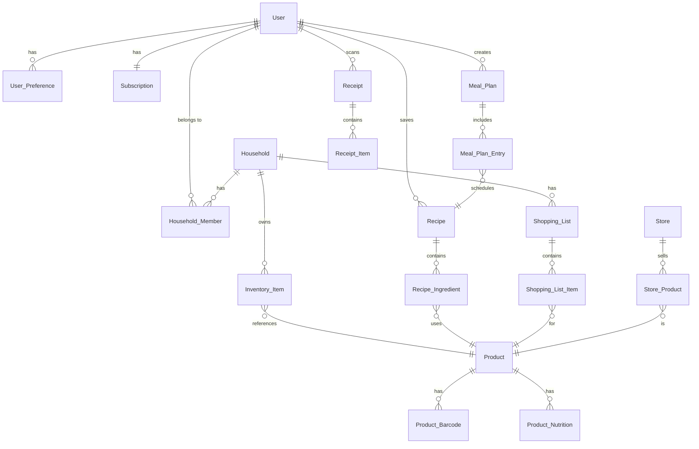

# Data Model: Kitchentory

**Version**: 1.0.0
**Date**: 2025-09-18
**Status**: Final

## Entity Relationship Diagram



## Core Entities

### User
Represents an individual app user with authentication and preferences.

```typescript
interface User {
  id: string;                    // UUID
  email: string;                 // Unique, used for auth
  username: string;              // Display name
  password_hash: string;         // Bcrypt hashed
  created_at: Date;
  updated_at: Date;
  last_login: Date;
  email_verified: boolean;
  phone?: string;
  avatar_url?: string;
  timezone: string;              // User's timezone for notifications
  locale: string;                // Language preference
  push_token?: string;           // FCM/APNS token
  deleted_at?: Date;             // Soft delete
}
```

### Household
Groups users who share inventory and shopping lists.

```typescript
interface Household {
  id: string;                    // UUID
  name: string;                  // e.g., "Smith Family"
  created_by: string;            // User ID who created
  created_at: Date;
  updated_at: Date;
  invite_code: string;           // Unique code for joining
  settings: {
    currency: string;            // e.g., "USD"
    default_store_id?: string;
    auto_delete_expired: boolean;
    expiry_warning_days: number;
  };
}
```

### Household_Member
Junction table for User-Household many-to-many relationship.

```typescript
interface HouseholdMember {
  id: string;                    // UUID
  household_id: string;
  user_id: string;
  role: 'owner' | 'admin' | 'member' | 'viewer';
  joined_at: Date;
  invited_by?: string;           // User ID who invited
  can_edit_inventory: boolean;
  can_edit_recipes: boolean;
  can_edit_shopping: boolean;
  nickname?: string;             // Display name in household
}
```

### Subscription
Tracks user's payment tier and features.

```typescript
interface Subscription {
  id: string;                    // UUID
  user_id: string;               // One subscription per user
  tier: 'free' | 'pro' | 'premium';
  status: 'active' | 'cancelled' | 'past_due' | 'trialing';
  stripe_customer_id?: string;
  stripe_subscription_id?: string;
  current_period_start: Date;
  current_period_end: Date;
  cancel_at_period_end: boolean;
  trial_end?: Date;
  features: {
    max_items: number;           // 50, unlimited, unlimited
    max_recipes: number;         // 10, unlimited, unlimited
    receipt_scans: number;       // 0, 10, unlimited
    store_integrations: number;  // 0, 2, unlimited
    household_members: number;   // 1, 2, 5
  };
}
```

### Product
Master product catalog shared across all users.

```typescript
interface Product {
  id: string;                    // UUID
  name: string;                  // Generic name
  brand?: string;
  category: ProductCategory;
  subcategory?: string;
  description?: string;
  image_url?: string;
  is_perishable: boolean;
  typical_shelf_life_days?: number;
  storage_instructions?: string;
  unit_type: 'piece' | 'weight' | 'volume' | 'package';
  default_unit: string;          // e.g., "oz", "each", "lb"
  created_at: Date;
  updated_at: Date;
  verified: boolean;             // Admin-verified product
}

enum ProductCategory {
  PRODUCE = 'produce',
  DAIRY = 'dairy',
  MEAT = 'meat',
  SEAFOOD = 'seafood',
  BAKERY = 'bakery',
  FROZEN = 'frozen',
  PANTRY = 'pantry',
  BEVERAGES = 'beverages',
  SNACKS = 'snacks',
  CONDIMENTS = 'condiments',
  HOUSEHOLD = 'household',
  PERSONAL_CARE = 'personal_care',
  OTHER = 'other'
}
```

### Product_Barcode
Maps barcodes to products (one product can have multiple barcodes).

```typescript
interface ProductBarcode {
  id: string;                    // UUID
  product_id: string;
  barcode: string;               // UPC/EAN code
  barcode_type: 'upc_a' | 'upc_e' | 'ean_13' | 'ean_8';
  created_at: Date;
  source: string;                // e.g., "open_food_facts"
}
```

### Inventory_Item
Actual items in a household's inventory.

```typescript
interface InventoryItem {
  id: string;                    // UUID
  household_id: string;
  product_id: string;
  added_by: string;              // User ID
  quantity: number;
  unit: string;                  // e.g., "oz", "cups", "pieces"
  location: StorageLocation;
  purchase_date?: Date;
  expiration_date?: Date;
  opened_date?: Date;
  price?: number;
  notes?: string;
  created_at: Date;
  updated_at: Date;
  consumed_at?: Date;            // Soft delete when consumed
  photo_url?: string;            // User's photo of item
}

enum StorageLocation {
  PANTRY = 'pantry',
  FRIDGE = 'fridge',
  FREEZER = 'freezer',
  COUNTER = 'counter',
  CABINET = 'cabinet',
  OTHER = 'other'
}
```

### Recipe
Cooking instructions with ingredients and nutritional info.

```typescript
interface Recipe {
  id: string;                    // UUID
  created_by?: string;           // User ID if user-created
  name: string;
  description?: string;
  image_url?: string;
  source_url?: string;           // If imported from web
  source_type: 'user' | 'imported' | 'system';
  prep_time_minutes?: number;
  cook_time_minutes?: number;
  total_time_minutes?: number;
  servings: number;
  difficulty: 'easy' | 'medium' | 'hard';
  cuisine_type?: string;
  meal_type: MealType[];
  dietary_tags: DietaryTag[];
  instructions: RecipeStep[];
  tips?: string;
  created_at: Date;
  updated_at: Date;
  rating?: number;               // Average user rating
  times_cooked?: number;
  is_public: boolean;
}

interface RecipeStep {
  order: number;
  instruction: string;
  duration_minutes?: number;
  timer_needed: boolean;
}

enum MealType {
  BREAKFAST = 'breakfast',
  LUNCH = 'lunch',
  DINNER = 'dinner',
  SNACK = 'snack',
  DESSERT = 'dessert',
  DRINK = 'drink'
}

enum DietaryTag {
  VEGAN = 'vegan',
  VEGETARIAN = 'vegetarian',
  GLUTEN_FREE = 'gluten_free',
  DAIRY_FREE = 'dairy_free',
  KETO = 'keto',
  PALEO = 'paleo',
  LOW_CARB = 'low_carb',
  NUT_FREE = 'nut_free'
}
```

### Recipe_Ingredient
Ingredients required for a recipe.

```typescript
interface RecipeIngredient {
  id: string;                    // UUID
  recipe_id: string;
  product_id?: string;           // Optional link to product catalog
  name: string;                  // Display name
  quantity: number;
  unit: string;
  preparation?: string;          // e.g., "diced", "minced"
  optional: boolean;
  substitutions?: string[];      // Alternative ingredients
  group?: string;                // e.g., "For sauce", "For marinade"
  order: number;                 // Display order
}
```

### Meal_Plan
Weekly meal planning for a household.

```typescript
interface MealPlan {
  id: string;                    // UUID
  household_id: string;
  created_by: string;            // User ID
  name?: string;                 // e.g., "Week of Jan 15"
  start_date: Date;
  end_date: Date;
  created_at: Date;
  updated_at: Date;
  auto_generated: boolean;
  preferences: {
    budget?: number;
    dietary_restrictions: DietaryTag[];
    variety_level: 'low' | 'medium' | 'high';
    use_expiring_first: boolean;
  };
}
```

### Meal_Plan_Entry
Individual meals in a meal plan.

```typescript
interface MealPlanEntry {
  id: string;                    // UUID
  meal_plan_id: string;
  recipe_id: string;
  date: Date;
  meal_type: MealType;
  servings_planned: number;
  notes?: string;
  completed: boolean;
  completed_at?: Date;
  rating?: number;               // Post-meal rating
}
```

### Shopping_List
Grocery shopping list for a household.

```typescript
interface ShoppingList {
  id: string;                    // UUID
  household_id: string;
  created_by: string;            // User ID
  name?: string;                 // e.g., "Weekly groceries"
  created_at: Date;
  updated_at: Date;
  completed_at?: Date;
  store_id?: string;
  estimated_total?: number;
  actual_total?: number;
  is_active: boolean;            // Only one active list per household
}
```

### Shopping_List_Item
Individual items in a shopping list.

```typescript
interface ShoppingListItem {
  id: string;                    // UUID
  shopping_list_id: string;
  product_id?: string;
  name: string;                  // Display name
  quantity: number;
  unit: string;
  category: ProductCategory;
  notes?: string;
  assigned_to?: string;          // User ID
  price_estimate?: number;
  store_aisle?: string;
  checked: boolean;
  checked_by?: string;           // User ID
  checked_at?: Date;
  source: 'manual' | 'inventory' | 'meal_plan' | 'auto';
}
```

### Store
Grocery stores with integration capabilities.

```typescript
interface Store {
  id: string;                    // UUID
  name: string;
  chain: string;                 // e.g., "Walmart", "Kroger"
  address?: string;
  latitude?: number;
  longitude?: number;
  phone?: string;
  hours?: StoreHours[];
  has_delivery: boolean;
  has_pickup: boolean;
  integration_type: 'api' | 'scraping' | 'none';
  api_config?: {
    endpoint?: string;
    api_key?: string;
    store_id?: string;
  };
  layout_map?: StoreLayout[];
  created_at: Date;
  updated_at: Date;
}

interface StoreHours {
  day: string;
  open: string;
  close: string;
}

interface StoreLayout {
  aisle: string;
  categories: ProductCategory[];
}
```

### Receipt
Scanned grocery receipts.

```typescript
interface Receipt {
  id: string;                    // UUID
  user_id: string;
  household_id: string;
  store_id?: string;
  image_url: string;
  ocr_text?: string;             // Raw OCR output
  ocr_confidence?: number;
  total: number;
  tax?: number;
  date: Date;
  payment_method?: string;
  created_at: Date;
  processed: boolean;
  processing_errors?: string[];
}
```

### Receipt_Item
Items extracted from receipts.

```typescript
interface ReceiptItem {
  id: string;                    // UUID
  receipt_id: string;
  product_id?: string;           // Matched product from catalog
  raw_text: string;              // OCR extracted text
  name: string;                  // Cleaned product name
  quantity: number;
  unit_price: number;
  total_price: number;
  confidence: number;            // OCR confidence
  manually_verified: boolean;
  added_to_inventory: boolean;
}
```

### User_Preference
User settings and preferences.

```typescript
interface UserPreference {
  id: string;                    // UUID
  user_id: string;
  dietary_restrictions: DietaryTag[];
  allergies: string[];
  disliked_ingredients: string[];
  favorite_cuisines: string[];
  cooking_skill: 'beginner' | 'intermediate' | 'advanced';
  household_size: number;
  notification_settings: {
    expiry_alerts: boolean;
    meal_reminders: boolean;
    shopping_reminders: boolean;
    price_alerts: boolean;
    weekly_summary: boolean;
  };
  privacy_settings: {
    share_recipes: boolean;
    show_in_leaderboard: boolean;
    allow_analytics: boolean;
  };
}
```

## Indexes and Constraints

### Primary Indexes
- All `id` fields are primary keys with UUID type
- All `created_at` and `updated_at` fields are indexed

### Foreign Key Constraints
- All `_id` suffix fields reference their parent entity
- Cascade delete for dependent entities
- Restrict delete for referenced entities

### Unique Constraints
- `User.email` - unique across system
- `Household.invite_code` - unique across system
- `ProductBarcode.barcode` - unique across system
- `Store.api_config.store_id` + `Store.chain` - composite unique

### Performance Indexes
```sql
-- Inventory queries
CREATE INDEX idx_inventory_household_expiry ON inventory_item(household_id, expiration_date);
CREATE INDEX idx_inventory_location ON inventory_item(household_id, location);

-- Recipe search
CREATE INDEX idx_recipe_dietary ON recipe USING GIN(dietary_tags);
CREATE INDEX idx_recipe_meal_type ON recipe USING GIN(meal_type);

-- Shopping list
CREATE INDEX idx_shopping_active ON shopping_list(household_id, is_active);
CREATE INDEX idx_shopping_item_checked ON shopping_list_item(shopping_list_id, checked);

-- Product search
CREATE INDEX idx_product_name ON product USING GIN(to_tsvector('english', name));
CREATE INDEX idx_product_category ON product(category);
```

## Data Validation Rules

### User
- Email must be valid format
- Username 3-30 characters, alphanumeric + underscore
- Password minimum 8 characters, 1 uppercase, 1 number

### Inventory Item
- Quantity must be positive
- Expiration date must be future (when adding)
- Location must be valid enum value

### Recipe
- At least one ingredient required
- At least one instruction step required
- Servings must be positive integer
- Times must be non-negative

### Shopping List
- Only one active list per household
- Items cannot have negative quantities

## State Transitions

### Inventory Item Lifecycle
```
Created → Active → Low Stock → Consumed/Expired → Deleted
```

### Shopping List Lifecycle
```
Draft → Active → Shopping → Completed → Archived
```

### Meal Plan Lifecycle
```
Planned → Active → In Progress → Completed → Archived
```

### Subscription Status
```
Trial → Active ↔ Past Due → Cancelled → Expired
```

## Data Retention Policies

- **User Data**: Soft delete, retain for 30 days then hard delete
- **Inventory History**: Keep consumed items for 90 days
- **Receipts**: Retain for 1 year for expense tracking
- **Meal Plans**: Archive after 30 days, delete after 1 year
- **Shopping Lists**: Archive completed lists after 7 days

## Privacy Considerations

- Household members can only see their household's data
- Recipe sharing is opt-in
- Purchase history is private to household
- Analytics data is anonymized
- GDPR-compliant data export/deletion

---

**Next**: Generate API contracts based on this data model